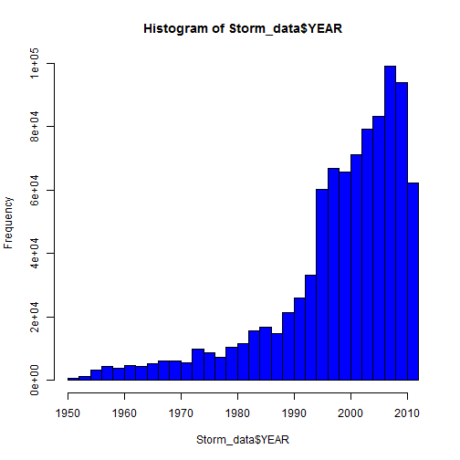
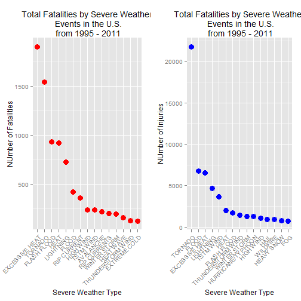
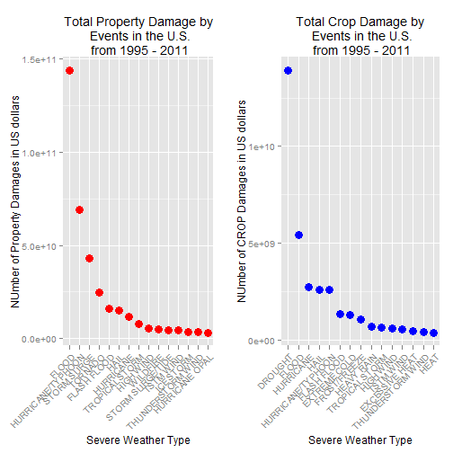

#  Impact of Severe Weather Events across the United States from 1955 to 2011

## Synopsis

### In this analysis, we will show the impact of different type of severe weather events on public health and economic conditions across communities and municipalities. We will use data collected from the US National Oceaninc and Atmosphere Adminstration's (NOAA) from 1950- 2011. Many of these severe events may result in fatalities, injuries, and property damage. We will gather these fatalites, injuries, and property damage for each weather events and report which types of event are most harmful to the population health and economy. From these data, we found that excessive heat and tornado are most harmful with respect to population health, while flood, drought, and hurricane/typhoon have the greatest economic consequences.

## Tools used


```r
library(R.utils)
library(plyr)
library(ggplot2)
library(gridExtra)
```

## Data Reading and Processing
### We download the data and unzip it


```r
fileUrl <-  "https://d396qusza40orc.cloudfront.net/repdata/data/StormData.csv.bz2"

download.file(fileUrl, destfile= "StormData.csv.bz2")
bunzip2("StormData.csv.bz2")
```

```
## Error in decompressFile.default(filename = filename, ..., ext = ext, FUN = FUN): File already exists: StormData.csv
```

### Then we read the data and generate a csv file. We also get the dimension of the data read in.  


```r
Storm_data <- read.csv("StormData.csv")
dim(Storm_data)
```

```
## [1] 902297     37
```

### There are 902297 rows and 37 columns total in this dataset. The events in the database start in the year 1950 and end in November 2011.  Since in the earlier years of the database, there are generally fewer events recorded, and most are likely due to a lack of good records.  We would like to analyze data only for recent years.

## Exploring the data

```r
head(Storm_data, n= 3)
```

```
##   STATE__          BGN_DATE BGN_TIME TIME_ZONE COUNTY COUNTYNAME STATE
## 1       1 4/18/1950 0:00:00     0130       CST     97     MOBILE    AL
## 2       1 4/18/1950 0:00:00     0145       CST      3    BALDWIN    AL
## 3       1 2/20/1951 0:00:00     1600       CST     57    FAYETTE    AL
##    EVTYPE BGN_RANGE BGN_AZI BGN_LOCATI END_DATE END_TIME COUNTY_END
## 1 TORNADO         0                                               0
## 2 TORNADO         0                                               0
## 3 TORNADO         0                                               0
##   COUNTYENDN END_RANGE END_AZI END_LOCATI LENGTH WIDTH F MAG FATALITIES
## 1         NA         0                      14.0   100 3   0          0
## 2         NA         0                       2.0   150 2   0          0
## 3         NA         0                       0.1   123 2   0          0
##   INJURIES PROPDMG PROPDMGEXP CROPDMG CROPDMGEXP WFO STATEOFFIC ZONENAMES
## 1       15    25.0          K       0                                    
## 2        0     2.5          K       0                                    
## 3        2    25.0          K       0                                    
##   LATITUDE LONGITUDE LATITUDE_E LONGITUDE_ REMARKS REFNUM
## 1     3040      8812       3051       8806              1
## 2     3042      8755          0          0              2
## 3     3340      8742          0          0              3
```

```r
Storm_data$YEAR <- as.numeric(format(as.Date(Storm_data$BGN_DATE, format = "%m/%d/%Y %H:%M:%S"), "%Y"))
```

## Histogram 1


```r
hist(Storm_data$YEAR, col= "blue", breaks = 40)
```

 


### Based on the above histogram, we see that the number of events begins to increase from 1990 to 2011. Thus, we subset the data from 1990 to 2011 to get the most of our data for complete analysis. 

## Subset our data from 1990 to 2011


```r
Storm_data <- Storm_data[Storm_data$YEAR >= 1995, ]
```

### Dimension of data

```r
dim(Storm_data)
```

```
## [1] 681500     38
```

### By subsetting, there are now 681500 rows and 38 columns in total.

## Impact on Public Health

### In this section, we will check the number of fatalities and injuries that are caused by the severe weather events. We would like to get the first 15 most severe types of weather events.


```r
sort_Most <- function(keyName, top = 15, dataset= Storm_data)
{   index <- which(colnames(dataset) == keyName)

    field <- aggregate(dataset[, index], by = list(dataset$EVTYPE), FUN = "sum")
    names(field) <- c("EVTYPE", keyName)
    field <- arrange(field, field[, 2], decreasing = T)
    field <- head(field, n = top)
    field <- within(field, EVTYPE <- factor(x = EVTYPE, levels = field$EVTYPE))
    return(field)
}

  fatalities <- sort_Most("FATALITIES", dataset= Storm_data)
  injuries <- sort_Most("INJURIES", dataset = Storm_data)
```

## Impact on Economy
  
###  Convert property damage and crop damage into comparable numerical forms according to the meaning of units described in the code book(Storm Events). Both PROPDMGEXP and CROPDMGEXP columns record a multiplier for each observation where we have Hundred(H), Thousand(K), Million (M), and Billion (B).


```r
 convert <- function(dataset = Storm_data, keyName, newFieldName) {
    totalLen <- dim(dataset)[2]
    index <- which(colnames(dataset) == keyName)
    dataset[, index] <- as.character(dataset[, index])
    logic <- !is.na(toupper(dataset[, index]))
    dataset[logic & toupper(dataset[, index]) == "B", index] <- "9"
    dataset[logic & toupper(dataset[, index]) == "M", index] <- "6"
    dataset[logic & toupper(dataset[, index]) == "K", index] <- "3"
    dataset[logic & toupper(dataset[, index]) == "H", index] <- "2"
    dataset[logic & toupper(dataset[, index]) == "", index] <- "0"
    dataset[, index] <- as.numeric(dataset[, index])
    dataset[is.na(dataset[, index]), index] <- 0
    dataset <- cbind(dataset, dataset[, index - 1] * 10^dataset[, index])
    names(dataset)[totalLen + 1] <- newFieldName
    return(dataset)
  }
  
Storm_data <- convert(Storm_data, "PROPDMGEXP", "propertyDamage") 
```

```
## Warning in convert(Storm_data, "PROPDMGEXP", "propertyDamage"): NAs
## introduced by coercion
```

```r
Storm_data <- convert(Storm_data, "CROPDMGEXP", "cropDamage")
```

```
## Warning in convert(Storm_data, "CROPDMGEXP", "cropDamage"): NAs introduced
## by coercion
```

```r
names(Storm_data)
```

```
##  [1] "STATE__"        "BGN_DATE"       "BGN_TIME"       "TIME_ZONE"     
##  [5] "COUNTY"         "COUNTYNAME"     "STATE"          "EVTYPE"        
##  [9] "BGN_RANGE"      "BGN_AZI"        "BGN_LOCATI"     "END_DATE"      
## [13] "END_TIME"       "COUNTY_END"     "COUNTYENDN"     "END_RANGE"     
## [17] "END_AZI"        "END_LOCATI"     "LENGTH"         "WIDTH"         
## [21] "F"              "MAG"            "FATALITIES"     "INJURIES"      
## [25] "PROPDMG"        "PROPDMGEXP"     "CROPDMG"        "CROPDMGEXP"    
## [29] "WFO"            "STATEOFFIC"     "ZONENAMES"      "LATITUDE"      
## [33] "LONGITUDE"      "LATITUDE_E"     "LONGITUDE_"     "REMARKS"       
## [37] "REFNUM"         "YEAR"           "propertyDamage" "cropDamage"
```

```r
property_damage <- sort_Most("propertyDamage", dataset= Storm_data)

crop_damage <- sort_Most("cropDamage", dataset = Storm_data)
```

## Results

### The impact on public health is shown below by two sorted lists of severe weather events by number of people badly affected.

### List of fatalities with respect to weather conditions from extreme cases to less extreme cases

```r
fatalities
```

```
##               EVTYPE FATALITIES
## 1     EXCESSIVE HEAT       1903
## 2            TORNADO       1545
## 3        FLASH FLOOD        934
## 4               HEAT        924
## 5          LIGHTNING        729
## 6              FLOOD        423
## 7        RIP CURRENT        360
## 8          HIGH WIND        241
## 9          TSTM WIND        241
## 10         AVALANCHE        223
## 11      RIP CURRENTS        204
## 12      WINTER STORM        195
## 13         HEAT WAVE        161
## 14 THUNDERSTORM WIND        131
## 15      EXTREME COLD        126
```

### List of injuries with respect to weather conditions from extreme to less extreme

```r
injuries
```

```
##               EVTYPE INJURIES
## 1            TORNADO    21765
## 2              FLOOD     6769
## 3     EXCESSIVE HEAT     6525
## 4          LIGHTNING     4631
## 5          TSTM WIND     3630
## 6               HEAT     2030
## 7        FLASH FLOOD     1734
## 8  THUNDERSTORM WIND     1426
## 9       WINTER STORM     1298
## 10 HURRICANE/TYPHOON     1275
## 11         HIGH WIND     1093
## 12              HAIL      916
## 13          WILDFIRE      911
## 14        HEAVY SNOW      751
## 15               FOG      718
```


### Graphs of total fatalities and total injuries affected by these severe weather events


```r
g_fatalities <- ggplot(fatalities, aes(EVTYPE, FATALITIES))
 
facilitiesplot <- g_fatalities + geom_point(size = 4, col= "red")+ 
labs(x = "Severe Weather Type")+ labs(y = "NUmber of Fatalities")+ 
labs(title="Total Fatalities by Severe Weather\n Events in the U.S.\n from 1995 - 2011" )+ 
theme(axis.text.x = element_text(angle = 45, hjust = 1)) 
 
 
 g_injuries <- ggplot(injuries, aes(EVTYPE, INJURIES))
 
 injuriesplot <- g_injuries + geom_point(size = 4, col= "blue") + labs(x = "Severe Weather Type")+ 
 labs(y = "NUmber of Injuries")+ 
 labs(title="Total Fatalities by Severe Weather\n Events in the U.S.\n from 1995 - 2011" )+ 
 theme(axis.text.x = element_text(angle = 45, hjust = 1)) 
```


### Plots showing the number of fatalities with respect to Severe weather condition
### Panel Plot1

```r
grid.arrange(facilitiesplot, injuriesplot, ncol = 2)
```

 


### Based on the plots above, excessive head and tornado cause most fatalities, while tornados cause most injuries in the US from 1995- 2011. 
### As for the impact on economy, we got two sorted lists below by the amount money cost by damages.

### List of property damage with respect to weather conditions from extreme to less extreme

```r
property_damage
```

```
##               EVTYPE propertyDamage
## 1              FLOOD   144022037057
## 2  HURRICANE/TYPHOON    69305840000
## 3        STORM SURGE    43193536000
## 4            TORNADO    24935939545
## 5        FLASH FLOOD    16047794571
## 6               HAIL    15048722103
## 7          HURRICANE    11812819010
## 8     TROPICAL STORM     7653335550
## 9          HIGH WIND     5259785375
## 10          WILDFIRE     4759064000
## 11  STORM SURGE/TIDE     4641188000
## 12         TSTM WIND     4482361440
## 13         ICE STORM     3643555810
## 14 THUNDERSTORM WIND     3399282992
## 15    HURRICANE OPAL     3172846000
```


### List of crop damage with respect to weather conditions from extreme to less extreme

```r
crop_damage 
```

```
##               EVTYPE  cropDamage
## 1            DROUGHT 13922066000
## 2              FLOOD  5422810400
## 3          HURRICANE  2741410000
## 4               HAIL  2614127070
## 5  HURRICANE/TYPHOON  2607872800
## 6        FLASH FLOOD  1343915000
## 7       EXTREME COLD  1292473000
## 8       FROST/FREEZE  1094086000
## 9         HEAVY RAIN   728399800
## 10    TROPICAL STORM   677836000
## 11         HIGH WIND   633561300
## 12         TSTM WIND   553947350
## 13    EXCESSIVE HEAT   492402000
## 14 THUNDERSTORM WIND   414354000
## 15              HEAT   401411500
```


### This is a pair of grapsh illustrating total property damage and total crop damage affected by severe events.


```r
g_property <- ggplot(property_damage, aes(EVTYPE, propertyDamage))
 
Property_plot <- g_property + geom_point(size = 4, col= "red") + labs(x = "Severe Weather Type")+ 
labs(y = "NUmber of Property Damages in US dollars")+ 
labs(title="Total Property Damage by\n Events in the U.S.\n from 1995 - 2011" )+ theme(axis.text.x = element_text(angle = 45, hjust = 1)) 
 

g_crop <- ggplot(crop_damage, aes(EVTYPE, cropDamage))
 
Crop_plot <- g_crop + geom_point(size = 4, col= "blue") + labs(x = "Severe Weather Type")+ 
labs(y = "NUmber of CROP Damages in US dollars")+ 
labs(title="Total Crop Damage by\n Events in the U.S.\n from 1995 - 2011" )+ theme(axis.text.x = element_text(angle = 45, hjust = 1)) 
```


### Plots showing the total property and crop damage with respect to the type of severe weather
### Panel Plot2 

```r
grid.arrange(Property_plot, Crop_plot, ncol = 2)
```

 

### Based on the above graphs, the events that cause the most property damage are flood and hurricane/typhoon. 
### Drought and flood causes the most crop damage in the US from 1995 to 2011.


## Conclusion

### From these analysis, we found that excessive heat and tornado are the most harmful with respect to population health, while flood,drought,and hurricane/typhoon have the greatest econcomic consequences. 

## Run and publishing the analysis


```r
library(knitr)
knit2html("RePResearchPeerAssessment2.Rmd")
```

```
## 
## 
## processing file: RePResearchPeerAssessment2.Rmd
```

```
## Error in parse_block(g[-1], g[1], params.src): duplicate label 'Histogram'
```

```r
browseURL("RePResearchPeerAssessment2.html")
```


